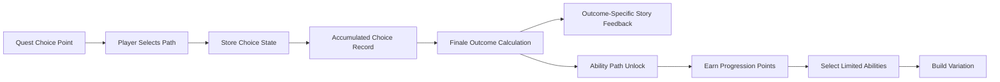

# Choice Progression Flow

This diagram shows a generalized branching progression system where player choices affect stored state, finale outcomes, and later ability unlocks.

## What This Represents

- Multiple choice points across a longer journey.
- Persistent player-specific state.
- Outcome calculation from accumulated choices.
- Unlockable abilities tied to narrative progression.
- Replayability and build variation.

## Public Sharing Note

This is a sanitized architecture diagram. It does not include raw scripts, real database schema, private player data, or implementation details that could expose live platform internals.
