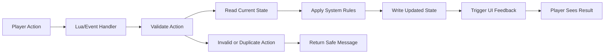

# Player Action to SQL Flow

This diagram shows the generalized flow from a player action to persistent state and UI feedback.

## What This Represents

- Event-driven interaction flow.
- Scripted validation before state changes.
- SQL-backed persistence.
- UI feedback tied to stored state.
- Duplicate or invalid action handling.

## Public Sharing Note

This is a sanitized architecture diagram. It does not include raw code, exact database names, private IDs, server details, or exploit-sensitive logic.
